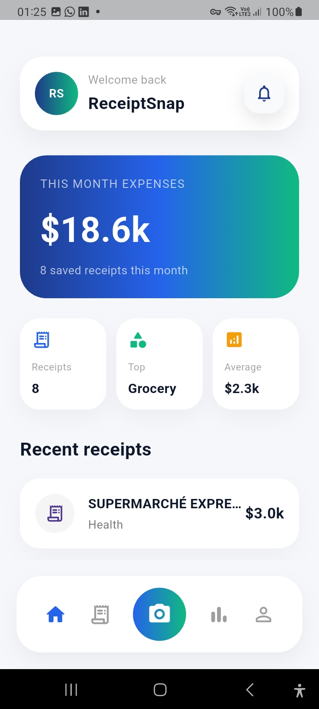
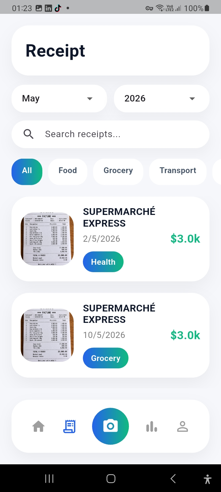
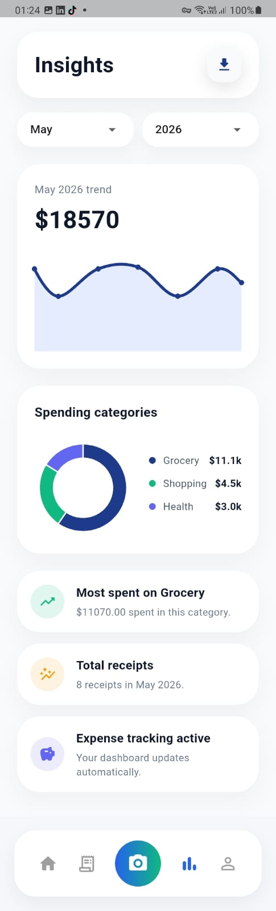
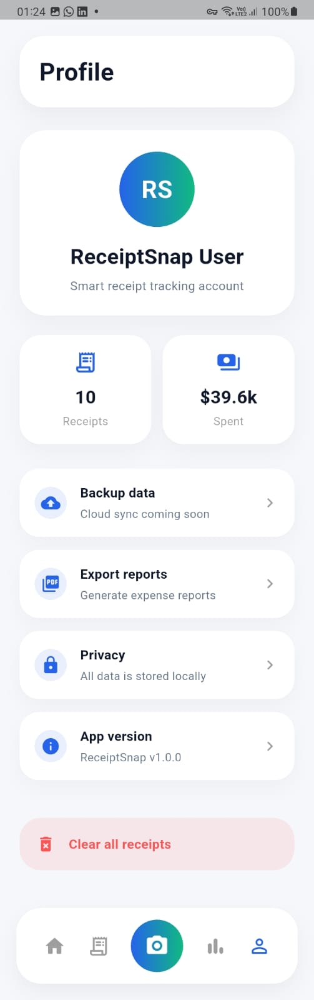

<p align="center">
  
</p>

<h1 align="center">ReceiptSnap</h1>

<p align="center">
  Smart Receipt Scanner & Expense Tracker built with Flutter
</p>

<p align="center">
  
  
  
  
  
</p>

---

## Overview

ReceiptSnap is a modern Flutter application designed to simplify receipt management and expense tracking.

Using Google ML Kit OCR, the app automatically extracts important information from receipts such as:

* Merchant name
* Amount
* Date
* Category

All data is stored locally using Hive, allowing users to organize receipts, monitor spending habits, generate insights, and export professional PDF reports.

---

## Demo

<p align="center">
  
</p>

---

## Features

### Receipt Scanning

* OCR receipt scanning
* Automatic merchant detection
* Automatic amount extraction
* Date recognition
* Smart category detection

### Expense Tracking

* Receipt history management
* Monthly filtering
* Yearly filtering
* Spending analytics dashboard
* Category-based insights

### Reporting

* PDF report export
* Local offline storage
* Fast data retrieval with Hive

### User Experience

* Modern fintech-inspired UI
* Mobile-first responsive design
* Smooth navigation
* Clean analytics experience

---

## Screenshots

### Home

<p align="center">
  
</p>

### Scan

<p align="center">
  
</p>

### Receipts

<p align="center">
  
</p>

### Insights

<p align="center">
  
</p>

### Profile

<p align="center">
  
</p>

---

## Installation

Clone the repository:

```bash
git clone https://github.com/SalmaEzzer/receiptsnap.git
cd receiptsnap
```

Install dependencies:

```bash
flutter pub get
```

Run the application:

```bash
flutter run
```

Build APK:

```bash
flutter build apk --release
```

---

## Download APK

Latest release:

https://github.com/SalmaEzzer/receiptsnap/releases/latest

---

## Tech Stack

* Flutter
* Dart
* Google ML Kit OCR
* Hive Database
* FL Chart
* PDF Package

---

## Application Architecture

```text
Receipt Image
      ↓
Google ML Kit OCR
      ↓
Data Extraction
      ↓
Hive Local Storage
      ↓
Analytics Dashboard
      ↓
PDF Report Export
```

---

## Challenges Solved

* Receipt OCR parsing
* Automatic amount detection
* Expense categorization
* Monthly and yearly filtering
* Local-first data storage
* PDF report generation
* Responsive mobile UI

---

## Limitations

* OCR accuracy depends on image quality, lighting conditions, and receipt language.
* Some receipt formats may require manual corrections.
* Data is stored locally using Hive.
* Cloud synchronization is not available in the current version.
* Authentication is not included in the current release.

---

## Future Improvements

* Firebase Authentication
* Cloud Sync
* Budget Management
* Spending Goals
* Multi-device Synchronization
* Multi-currency Support
* AI Spending Recommendations
* Smart Financial Insights

---

## Author

**Salma Ezzerrouti**

GitHub:
https://github.com/SalmaEzzer
